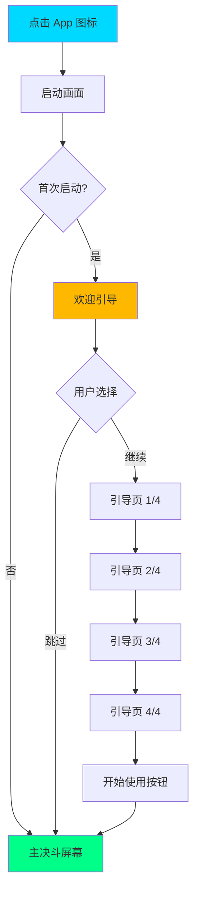
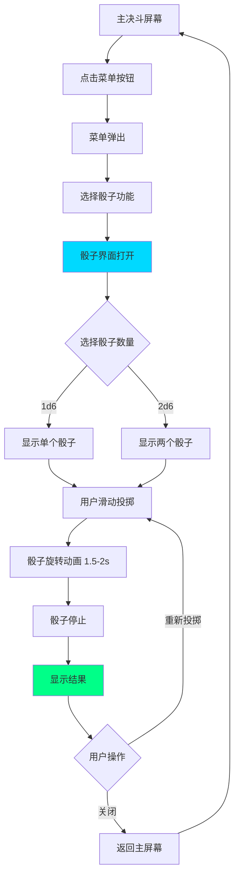
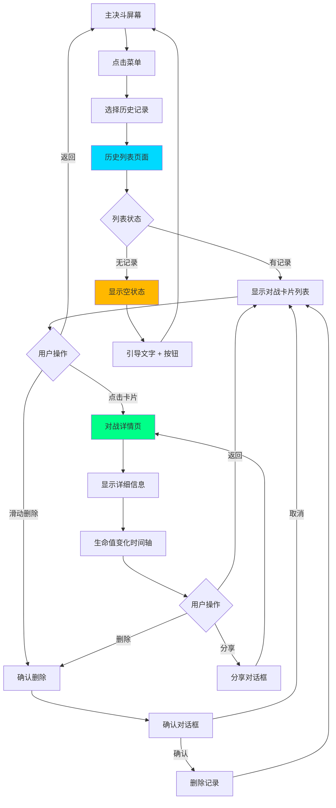
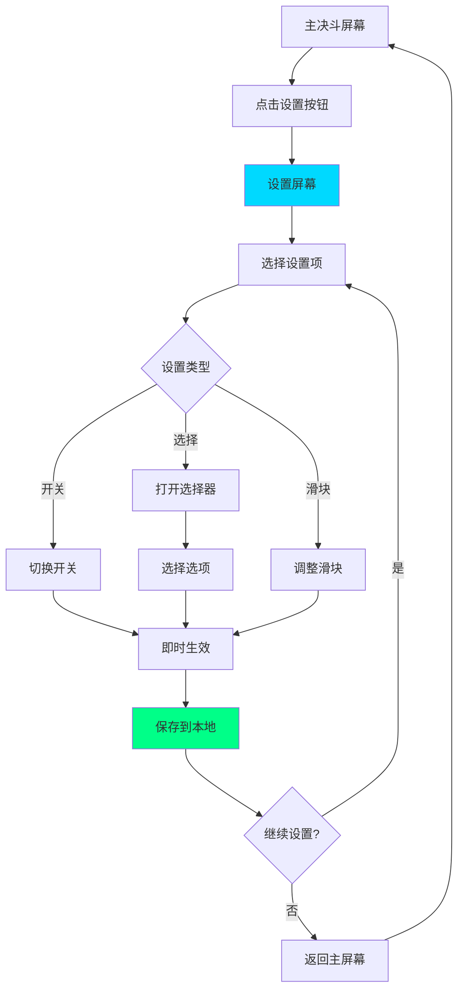

# 用户旅程地图与流程图

**专案名称：** bmad2 (Yu-Gi-Oh Duel Console)
**文档类型：** 用户旅程地图与交互流程设计
**日期：** 2025-11-13
**作者：** yyx
**版本：** 1.0

---

## 📋 概要

本文档详细描述 Yu-Gi-Oh Duel Console 的用户旅程地图、用户流程图和交互流程设计，帮助理解用户在不同场景下的行为路径和体验设计。

---

## 👤 **用户画像（Persona）**

### Persona 1: 阿杰（休闲玩家）

```
基本信息:
├─ 年龄: 22 岁
├─ 职业: 大学生
├─ 游戏频率: 每周 2-3 次
└─ 技术水平: 中等

特征:
├─ 享受与朋友面对面决斗
├─ 喜欢酷炫的视觉效果
├─ 不追求极速操作
└─ 重视社交和氛围

痛点:
├─ 现有计算器太无聊
├─ 缺乏决斗的氛围感
└─ 希望有更多互动乐趣

目标:
├─ 享受每一场对战
├─ 用酷炫的 App 吸引朋友注意
└─ 轻松追踪对战记录
```

### Persona 2: 小美（卡店常客）

```
基本信息:
├─ 年龄: 27 岁
├─ 职业: 上班族
├─ 游戏频率: 周末去卡店
└─ 技术水平: 高

特征:
├─ 喜欢参加卡店活动
├─ 重视对战数据统计
├─ 乐于尝试新工具
└─ 会向朋友推荐好用的 App

痛点:
├─ 希望能查看历史对战记录
├─ 想知道自己的胜率
└─ 现有计算器缺少数据功能

目标:
├─ 追踪对战历史和统计
├─ 提升对战体验
└─ 分享有趣的对战时刻
```

---

## 🗺️ **用户旅程地图**

### Journey 1: 首次使用体验

```
阶段 1: 发现
触点: 朋友推荐 / App Store 搜索
情绪: 😊 好奇、期待
思考: "这个 App 看起来很酷"
行为: 下载并安装

机会点:
├─ 应用商店页面要吸引人
├─ 截图和视频要展示视觉特效
└─ 评论要突出差异化

---

阶段 2: 启动
触点: 打开 App
情绪: 🤩 惊艳
思考: "哇，这个开场动画太酷了！"
行为: 观看启动动画

设计要点:
├─ 惊艳的开场动画（Tron 风格）
├─ 流畅的过渡效果
└─ 2-3 秒的合理时长

---

阶段 3: 引导
触点: 首次使用引导（可选跳过）
情绪: 🤔 学习
思考: "怎么使用滑动输入？"
行为: 浏览引导页面

设计要点:
├─ 简洁的 3-4 页引导
├─ 动画演示核心功能
├─ 可以跳过（已有经验用户）
└─ 不要过多文字说明

---

阶段 4: 首次对战
触点: 主决斗屏幕
情绪: 😃 兴奋、探索
思考: "试试滑动输入"
行为: 尝试向上/向下滑动

设计要点:
├─ 清晰的视觉提示（滑动图标）
├─ 即时的视觉反馈（光流动画）
├─ 流畅的动画过渡
└─ 鼓励性的视觉效果

---

阶段 5: 探索功能
触点: 菜单、辅助工具
情绪: 😊 满意、好奇
思考: "还有什么其他功能？"
行为: 探索骰子、硬币、设置

设计要点:
├─ 易于发现的菜单入口
├─ 一致的视觉语言
└─ 有趣的辅助功能动画

---

阶段 6: 完成对战
触点: 胜负动画、对战记录
情绪: 🎉 成就感
思考: "太棒了！自动保存了"
行为: 查看对战结果，准备下一局

设计要点:
├─ 华丽的胜负动画
├─ 自动保存（无需操作）
├─ 清晰的对战结果展示
└─ 快速开始下一局
```

**情绪曲线图：**
```
情绪
↑
|     🤩
|    /  \  😃
| 😊/    \/ \    🎉
|  /            \  \
| /              \  \
|/                \  \😊
+-------------------→ 时间
发现 启动 引导 对战 探索 完成
```

---

### Journey 2: 典型对战场景

```
场景: 周末下午，朋友家客厅决斗
参与者: 阿杰（我）vs 小明（朋友）

前期准备
├─ 阿杰：打开 App
├─ 看到: 主决斗屏幕，双玩家布局
├─ 行为: 将手机放在桌面中央
└─ 情绪: 😊 准备就绪

---

对战开始
├─ 双方: 开始抽卡、布局
├─ 阿杰: 手机显示双方生命值 8000
└─ 情绪: 😐 专注

---

第一次生命值变化
├─ 小明: 攻击成功，阿杰 -2000 LP
├─ 阿杰: 向下滑动（力道中等）
├─ 看到: 橘色光流冲击，粒子爆发
├─ 数字: 8000 → 6000 动画过渡
├─ 小明: "哇，这个 App 什么？好酷！"
└─ 情绪: 😃 满意（成功引起注意）

---

使用辅助工具
├─ 需要: 投骰子决定先后手
├─ 阿杰: 打开菜单 → 骰子
├─ 看到: 全屏骰子界面
├─ 行为: 滑动投掷
├─ 看到: 3D 骰子旋转动画，光轨跟随
├─ 结果: 显示 "5"，发光高亮
├─ 行为: 点击关闭，返回主屏幕
└─ 情绪: 😊 有趣

---

激烈对战阶段
├─ 双方: 频繁攻防
├─ 阿杰: 多次滑动调整生命值
├─ 看到: 呼吸光流随生命值变化
│  - 高 LP: 缓慢、平静
│  - 低 LP: 急促、紧张
├─ 小明: "你的生命值都变红了，紧张吧？"
└─ 情绪: 😰 紧张但兴奋

---

决斗结束
├─ 小明: 最终攻击
├─ 阿杰: 生命值归零
├─ 看到:
│  - 全屏光效爆发
│  - 小明方蓝色光环闪耀（获胜）
│  - 阿杰方暗淡（失败）
│  - 对战结果展示: 时长 15:32
├─ 行为: 点击 "重新开始"
└─ 情绪: 😄 虽然输了但体验很好

---

赛后查看
├─ 阿杰: 打开历史记录
├─ 看到: 刚才的对战已自动保存
├─ 行为: 查看详细数据
├─ 小明: "这个 App 叫什么？我也要下载！"
└─ 情绪: 🎉 成就感（成功推荐）
```

**触点地图：**
```
用户触点:
├─ 视觉: 光效、粒子、动画、颜色
├─ 触觉: 滑动手势、按钮点击
├─ 听觉: 音效（可选）
└─ 社交: 朋友反应、讨论
```

---

## 🔄 **核心用户流程图**

### Flow 1: 应用启动流程



**详细说明：**
- **启动画面**：2-3 秒 Tron 风格动画
- **首次启动判断**：检查 SharedPreferences
- **引导页面**：可跳过，每页 3-5 秒阅读时间
- **主屏幕**：默认显示双玩家，8000 LP

---

### Flow 2: 调整生命值流程

```mermaid
graph TD
    A[主决斗屏幕] --> B[用户开始滑动]
    B --> C[检测滑动方向]
    C -->|向上| D[增加生命值]
    C -->|向下| E[减少生命值]
    D --> F[计算滑动力道]
    E --> F
    F --> G[映射到生命值变化量]
    G --> H[更新生命值]
    H --> I[播放光流动画]
    I --> J[更新粒子密度]
    J --> K[保存变化记录]
    K --> L{生命值 = 0?}
    L -->|是| M[触发胜负动画]
    L -->|否| A
    M --> N[显示对战结果]
    N --> O{用户选择}
    O -->|重新开始| P[重置生命值]
    O -->|查看详情| Q[对战详情页]
    O -->|返回主页| A
    P --> A
    Q --> A

    style A fill:#0A0E1A
    style M fill:#FF6B35
    style N fill:#00FF88
```



**力道映射表：**
| 力道范围 | 生命值变化 | 视觉反馈 |
|----------|-----------|---------|
| 0-20 | ±100 | 细光流 |
| 20-40 | ±500 | 正常光流 |
| 40-60 | ±1000 | 明亮光流 |
| 60-80 | ±2000 | 强烈光流 + 粒子 |
| 80-100 | ±4000 | 爆发效果 |

---

### Flow 3: 使用骰子流程



**动画时间轴：**
```
0.0s        开始投掷
0.0-0.5s    加速旋转
0.5-1.3s    高速旋转（模糊效果）
1.3-1.8s    减速
1.8-2.0s    停止
2.0s        结果高亮
```

---

### Flow 4: 查看历史记录流程



---

### Flow 5: 蓝牙对战流程

```mermaid
graph TD
    A[主决斗屏幕] --> B[打开设置]
    B --> C[选择蓝牙对战]
    C --> D[蓝牙配对界面]
    D --> E{蓝牙状态}
    E -->|未开启| F[提示开启蓝牙]
    E -->|已开启| G[开始搜索设备]
    F --> H[用户开启蓝牙]
    H --> G
    G --> I[显示设备列表]
    I --> J{找到设备?}
    J -->|否| K[显示 "未找到设备"]
    J -->|是| L[选择设备]
    K --> M[重新搜索按钮]
    M --> G
    L --> N[连接中动画]
    N --> O{连接结果}
    O -->|失败| P[显示错误]
    O -->|成功| Q[连接成功提示]
    P --> R[重试按钮]
    R --> N
    Q --> S[对战倒数 3-2-1]
    S --> T[双机同步主屏幕]
    T --> U{对战中}
    U -->|生命值变化| V[自动同步到对方]
    U -->|连接断开| W[提示重连]
    U -->|对战结束| X[结果同步]
    V --> U
    W --> Y[自动重连]
    Y --> U
    X --> Z[返回主屏幕]
    Z --> A

    style D fill:#00D9FF
    style Q fill:#00FF88
    style P fill:#FF3366
    style T fill:#00FF88
```

**连接状态指示：**
```
状态栏显示：
├─ 🔵 搜索中（脉冲动画）
├─ 🟡 连接中（旋转动画）
├─ 🟢 已连接（呼吸动画）
└─ 🔴 断开连接（闪烁提示）
```

---

### Flow 6: 设置调整流程



**设置项列表：**
```
游戏设置
├─ 起始生命值: [4000] [8000✓] [16000]
└─ 动画速度: [0.5x] [1.0x✓] [1.5x] [2.0x]

视觉设置
├─ 显示粒子效果: [开✓] [关]
├─ 显示呼吸光流: [开✓] [关]
└─ 显示节拍视觉化: [开✓] [关]

音频设置
├─ 音效: [开✓] [关]
└─ 震动反馈: [开] [关✓]

其他
├─ 语言: [简体中文✓] [English]
└─ 关于: [版本信息]
```

---

## 🎬 **关键交互场景剧本**

### Scenario 1: 紧张时刻（生命值<500）

```
时间轴:
T=0s   玩家生命值降至 480
       ├─ 触发: 濒死状态
       ├─ 视觉: 红色警告闪烁
       ├─ 动画: 呼吸加速（0.6秒/周期）
       └─ 粒子: 稀疏、下坠、闪烁

T=1s   玩家注意到警告
       ├─ 思考: "糟糕，要输了！"
       └─ 情绪: 😰 紧张

T=2s   对手也看到警告
       ├─ 反应: "哈哈，你快输了！"
       └─ 情绪: 😄 兴奋

T=5s   玩家成功反击，+1000 LP
       ├─ 操作: 向上滑动
       ├─ 视觉: 蓝色光流注入
       ├─ 数字: 480 → 1480
       ├─ 状态: 从濒死 → 低生命值
       ├─ 动画: 呼吸放缓（1.0秒/周期）
       └─ 情绪: 😅 松了口气

设计要点:
├─ 濒死状态要有明显的视觉警告
├─ 颜色对比强烈（红色 vs 蓝橘）
├─ 动画节奏变化明显
└─ 给予玩家紧张但不恐慌的感觉
```

---

### Scenario 2: 朋友围观（社交场景）

```
场景: 卡店，3-4 个朋友围观对战

T=0s   对战开始
       ├─ 观众: 看到 App 界面
       └─ 反应: "这什么计算器？"

T=30s  第一次大伤害（-3000）
       ├─ 操作: 重滑动（力道 85）
       ├─ 视觉: 橘色光流爆发，大量粒子
       ├─ 数字: 8000 → 5000 快速过渡
       └─ 观众: "哇！这特效太酷了！"

T=1m   投掷骰子
       ├─ 操作: 打开骰子功能
       ├─ 视觉: 3D 骰子在光格网中旋转
       └─ 观众: "骰子都这么华丽？"

T=2m   生命值激烈变化
       ├─ 视觉: 呼吸光流随生命值起伏
       ├─ 观众: 跟随生命值紧张
       └─ 反应: "你要输了！" "还有机会！"

T=5m   决斗结束
       ├─ 视觉: 胜负光效爆发
       └─ 观众: 鼓掌、讨论

T=5m30s 有人问
        ├─ 问题: "这什么 App？"
        ├─ 回答: "Yu-Gi-Oh Duel Console"
        └─ 行为: 立即搜索下载

设计要点:
├─ 视觉效果要在第三人称视角也震撼
├─ 关键时刻的动画要足够引人注意
├─ 易于口头传播的名字
└─ 快速分享功能（扫码下载）
```

---

### Scenario 3: 快速连续对战

```
场景: 连续进行 3 场对战

第 1 场:
├─ 0:00  开始对战
├─ 5:30  对战结束
├─ 5:32  查看结果（2秒）
└─ 5:35  点击 "重新开始"

第 2 场:
├─ 5:36  立即开始（生命值重置动画 0.5s）
├─ 10:45 对战结束
└─ 10:47 重新开始

第 3 场:
├─ 10:48 开始
├─ 14:20 对战结束
└─ 14:25 查看历史记录

设计要点:
├─ "重新开始" 按钮要显眼
├─ 重置动画要快速流畅（<0.5秒）
├─ 自动保存，无需确认
├─ 历史记录按时间倒序
└─ 每场对战有唯一标识（时间戳）
```

---

## 🎯 **用户目标与成功指标**

### 用户目标分解

```
主要目标: 享受沉浸式决斗体验
├─ 子目标 1: 轻松管理生命值
│  ├─ 指标: 滑动输入成功率 >95%
│  ├─ 指标: 平均操作时间 <2秒
│  └─ 指标: 误操作率 <5%
│
├─ 子目标 2: 获得视觉享受
│  ├─ 指标: 动画流畅度 60fps
│  ├─ 指标: 用户评论提及 "酷炫" >50%
│  └─ 指标: 截图分享率 >20%
│
├─ 子目标 3: 查看对战数据
│  ├─ 指标: 历史记录访问率 >30%
│  ├─ 指标: 统计查看率 >15%
│  └─ 指标: 数据准确率 100%
│
└─ 子目标 4: 分享和推荐
   ├─ 指标: 自然推荐率 >40%
   ├─ 指标: 朋友也下载率 >25%
   └─ 指标: 社交媒体分享 >10%
```

---

## 📊 **流程优化机会**

### 当前痛点与改进

```
痛点 1: 首次使用不清楚如何操作
├─ 原因: 滑动输入不是常见交互
├─ 改进:
│  ├─ 添加动画引导
│  ├─ 首次使用显示提示
│  └─ 中央显示滑动手势图标
└─ 预期: 减少学习时间 50%

痛点 2: 误触导致错误操作
├─ 原因: 输入区域太大
├─ 改进:
│  ├─ 定义有效滑动区域
│  ├─ 最小滑动距离阈值（30px）
│  └─ 添加撤销功能（易访问）
└─ 预期: 误操作率 <5%

痛点 3: 找不到辅助功能
├─ 原因: 菜单入口不明显
├─ 改进:
│  ├─ 更显眼的菜单按钮
│  ├─ 首次使用时高亮提示
│  └─ 快捷手势（长按）
└─ 预期: 功能发现率 >80%

痛点 4: 蓝牙连接复杂
├─ 原因: 配对流程不够清晰
├─ 改进:
│  ├─ 分步引导
│  ├─ 清晰的状态反馈
│  ├─ 自动重连机制
│  └─ 详细的错误提示
└─ 预期: 连接成功率 >90%
```

---

## ✅ **流程设计检查清单**

### 可用性检查

```
□ 核心流程是否清晰？
  ├─ □ 用户能在 3 次点击内完成任务
  ├─ □ 导航路径直观
  └─ □ 返回操作始终可用

□ 反馈是否及时？
  ├─ □ 每次操作有即时反馈（<100ms）
  ├─ □ 加载状态有动画提示
  └─ □ 错误有清晰说明

□ 是否易于恢复？
  ├─ □ 支持撤销操作
  ├─ □ 确认危险操作
  └─ □ 自动保存数据

□ 是否一致？
  ├─ □ 交互模式一致
  ├─ □ 视觉风格统一
  └─ □ 用词准确一致
```

---

## 🎨 **流程可视化总结**

### 核心循环（Core Loop）

```
开始对战
    ↓
调整生命值 ←→ 使用辅助工具
    ↓         (骰子/硬币/计数器)
决斗结束
    ↓
查看结果 ←→ 查看历史/统计
    ↓
分享/推荐
    ↓
开始下一局
```

### 信息架构

```
应用
├─ 主决斗屏幕 [核心]
│  ├─ 玩家 1 区域
│  ├─ 玩家 2 区域
│  └─ 菜单入口
│
├─ 辅助功能 [次要]
│  ├─ 骰子
│  ├─ 硬币
│  └─ 计数器
│
├─ 数据查看 [次要]
│  ├─ 对战历史
│  └─ 统计数据
│
└─ 设置 [支持]
   ├─ 游戏设置
   ├─ 视觉设置
   ├─ 音频设置
   ├─ 蓝牙对战
   └─ 关于
```

---

**🗺️ Generated with BMad Method**
**📅 Date: 2025-11-13**
**👤 Author: yyx**
**🤖 Agent: Claude Code - UX Designer**
